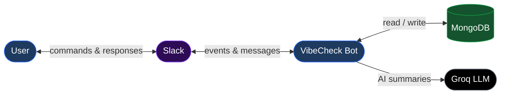

# System Block Diagram

## Overview

A high-level view of the VibeCheck system. Users interact through Slack, which communicates with the VibeCheck bot hosted on Railway. The bot stores data in MongoDB and calls a Groq LLM for AI-generated responses.

---

## Component Details

### User
The end user interacts with VibeCheck entirely through Slack — no separate app or interface is required. Users send slash commands, respond to prompts, and receive messages all within their existing Slack workspace.

---

### Slack
Slack is the user-facing interface for VibeCheck. It receives user input (commands and messages), forwards events to the VibeCheck bot, and delivers bot responses back to channels and DMs.

---

### VibeCheck Bot (Railway)
The core of the system, hosted on Railway. It handles all business logic: routing slash commands, running the daily prompt scheduler, managing user onboarding, tracking streaks, and connecting mentors with mentees. Built with Python using Slack Bolt and the Slack SDK.

---

### MongoDB
The database that persists all application data, including prompt statistics, user interests, streak records, and workspace installation tokens.

---

### Groq LLM
An external AI API used by the bot to generate vibe-check summaries and other AI-powered responses.