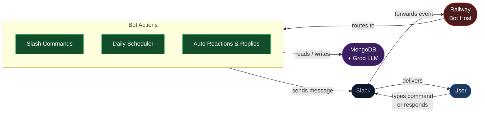

# System Block Diagram

## Overview

This is an illustration of the command flow between each component of VibeCheck. The system is Slack-specific, having users interact in Slack. Slack Bolt app handles routing and command events, the chatbot core runs business logic, and MongoDB persists activity and analytics.

            

## System Flow

Users communicate with VibeCheck through Slack. Slack delivers message events and slash commands through Socket Mode/Web API flows. The chatbot processes commands, schedules prompts, selects prompt content, generates responses, sends messages back to Slack, and stores activity data in MongoDB.

---

## Component Details

#### Slack API
- **Slack Bolt**
The Slack Bolt API allows VibeCheck to handle event routing, command events, and the ability to respond to user actions. Slack Bolt also includes a socket mode adapter, allowing communication without HTTP.
  
- **Slack SDK**
The Slack SDK is a library for Slack API calls, providing the core functionality of how VibeCheck interacts with the platform. Such functionalities include posting prompts, responding to channels, and retrieving server data

---

### Chatbot
The chatbot, VibeCheck, is the core project. It processes slash commands, contains a scheduler to trigger daily prompts, and logs responses to prompts. 

---

### Slack Integration Layer

Slack Bolt and Slack SDK provide the single integration layer for this project. The chatbot core is designed for Slack events and slash commands only.