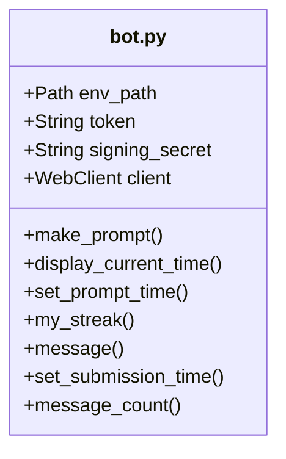

# Class Diagrams

For each component provide class diagrams showing the classes to be developed (or used) and their relationship.

```mermaid
classDiagram
    class bot.py {
        +Path env_path
        +String token
        +String signing_secret
        +WebClient client
        +make_prompt()
        +display_current_time()
        +set_prompt_time()
        +my_streak()
        +message()
        +set_submission_time()
        +message_count()
    }
```