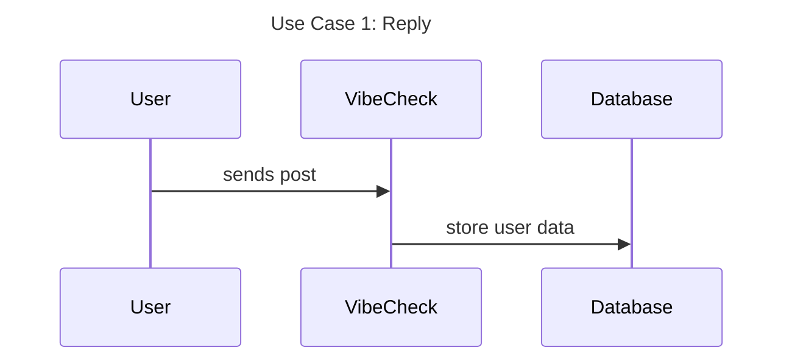
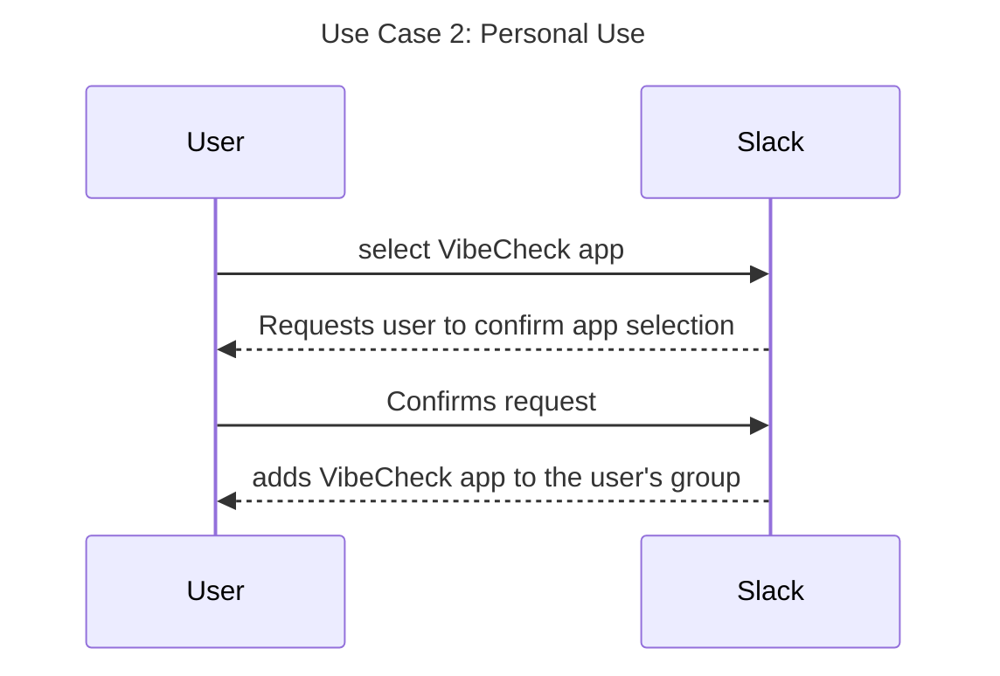
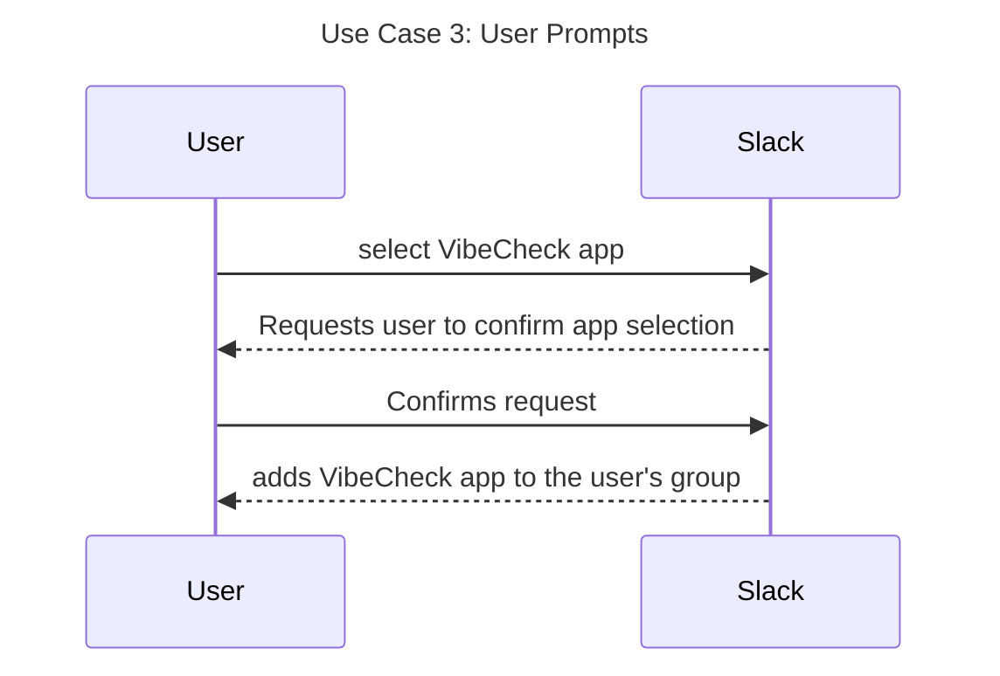
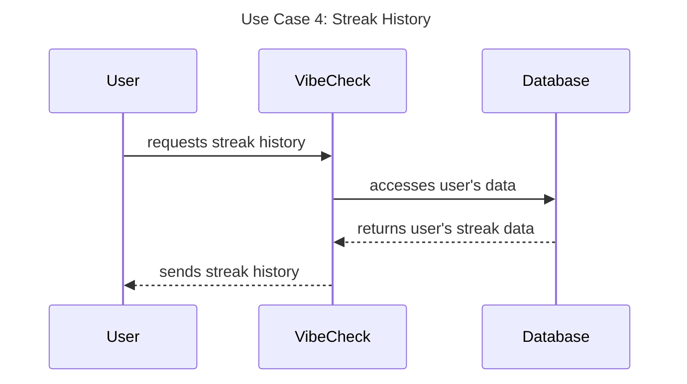
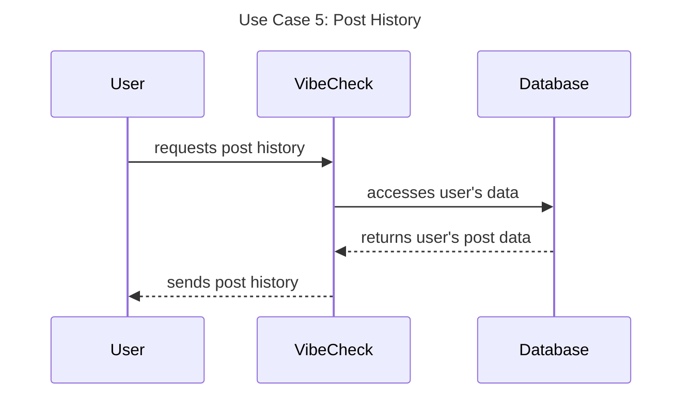
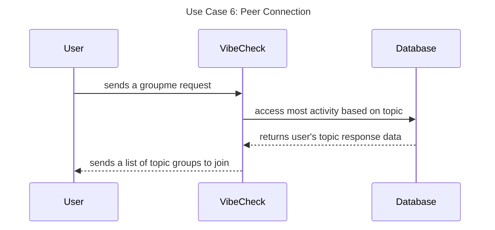

# Sequence Diagrams 
Sequence diagrams showing the data flow for all use cases. One sequence diagram corresponds to one use case and different use cases should have different corresponding sequence diagrams.

