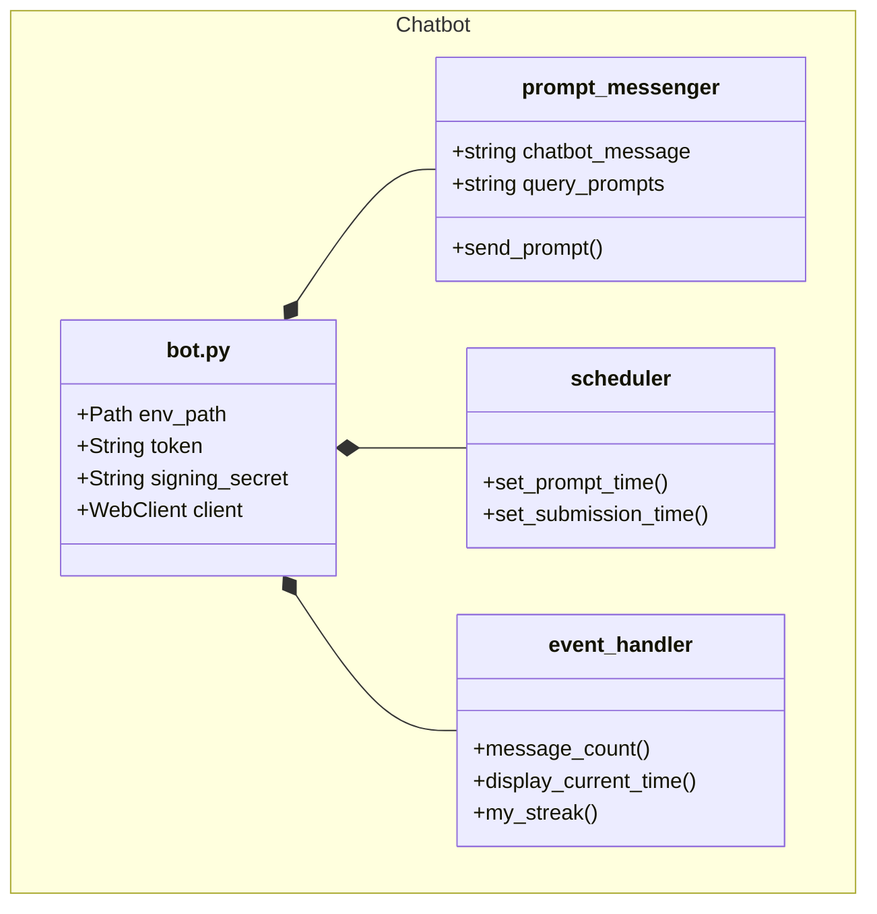
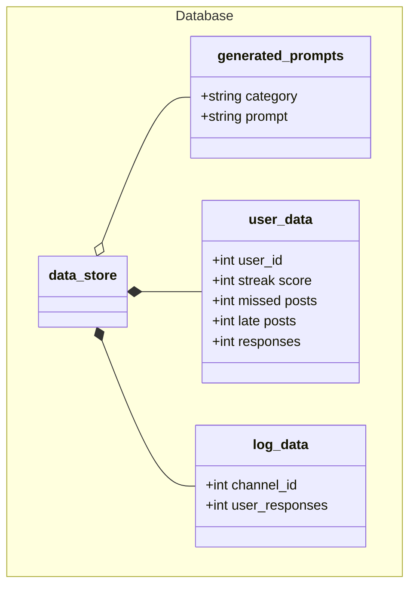

# class diagrams

The chatbot class diagram illustrates how other components of the chatbot will handle multiple core functions within Slack. The chatbot will contain necessary information such as its token, signing secret, and other identifiers. Each of its classes will provide specific functionalities to the overall chatbot. For instance, the scheduler will automatically set a prompt time and submission time if not configured. The prompt messenger will send the prompt by querying a random prompt from the database. For the event_handler, it will handle many of the commands that are sent to the chatbot.

The Database class diagram provides key insight into the class components the database will contain. Each type of data is contained within their own class to ensure no overlapping, maintaing structural integrity. User data will contain individual information to provide accurate responses from the user when running certain commands. log_data will contain information of the channel id and user responses to see which is most active and for what reason. generated prompts is made up thousands of potential prompts the chatbot can draw from the database to be used as a question to the users.
