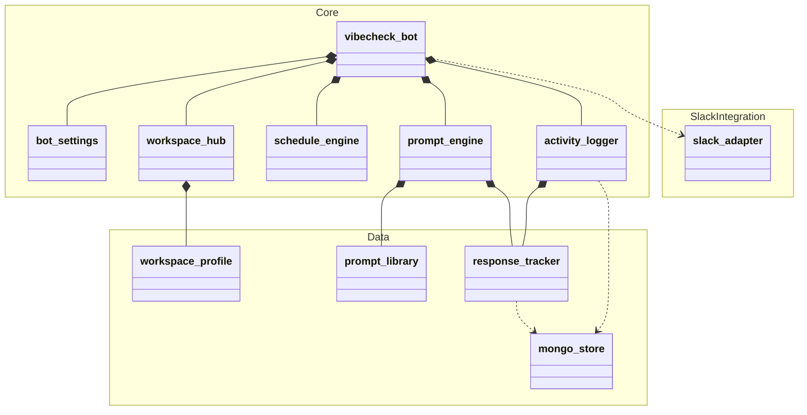
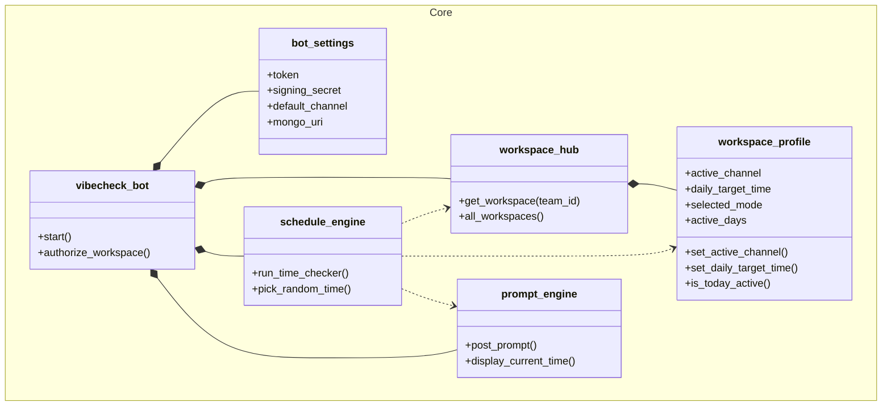
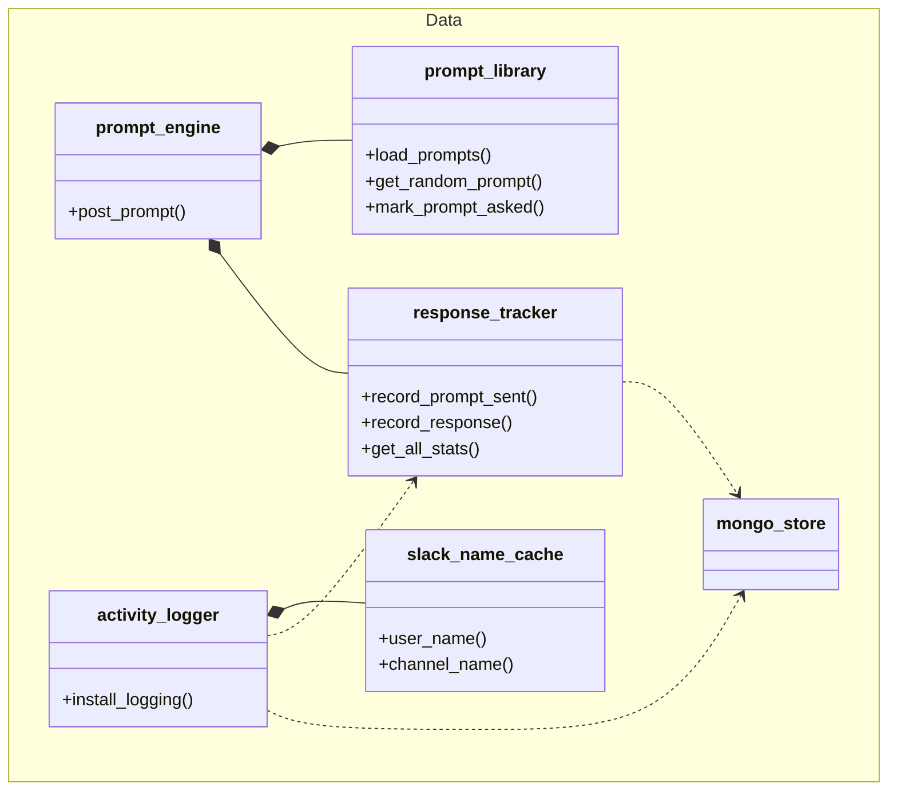
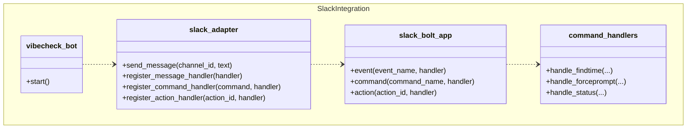

# Class Diagram

## __Overview__

```mermaid
classDiagram
direction TB
    namespace Core {
        class vibecheck_bot {
        }

        class bot_settings {
        }

        class workspace_hub {
        }

        class schedule_engine {
        }

        class prompt_engine {
        }

        class activity_logger {
        }
    }

    namespace Data {
        class workspace_profile {
        }

        class response_tracker {
        }

        class prompt_library {
        }

        class mongo_store {
        }
    }

    namespace SlackIntegration {
        class slack_adapter {
        }
    }

    vibecheck_bot *-- bot_settings
    vibecheck_bot *-- workspace_hub
    vibecheck_bot *-- schedule_engine
    vibecheck_bot *-- prompt_engine
    vibecheck_bot *-- activity_logger

    workspace_hub *-- workspace_profile
    prompt_engine *-- prompt_library
    prompt_engine *-- response_tracker
    activity_logger *-- response_tracker

    vibecheck_bot ..> slack_adapter
    activity_logger ..> mongo_store
    response_tracker ..> mongo_store
```

The overview shows the main pieces of VibeCheck in a way that reflects the bot's actual job. The vibecheck_bot coordinates scheduling, prompt posting, logging, and workspace control. The data layer keeps track of prompt content and engagement, and the Slack integration layer handles Slack-specific messaging and command wiring.

## __Core Component__

```mermaid
classDiagram
direction TB
    namespace Core {
        class vibecheck_bot {
            +start()
            +authorize_workspace()
        }

        class bot_settings {
            +token
            +signing_secret
            +default_channel
            +mongo_uri
        }

        class workspace_hub {
            +get_workspace(team_id)
            +all_workspaces()
        }

        class workspace_profile {
            +active_channel
            +daily_target_time
            +selected_mode
            +active_days
            +set_active_channel()
            +set_daily_target_time()
            +is_today_active()
        }

        class schedule_engine {
            +run_time_checker()
            +pick_random_time()
        }

        class prompt_engine {
            +post_prompt()
            +display_current_time()
        }
    }

    vibecheck_bot *-- bot_settings
    vibecheck_bot *-- workspace_hub
    vibecheck_bot *-- schedule_engine
    vibecheck_bot *-- prompt_engine
    workspace_hub *-- workspace_profile
    schedule_engine ..> workspace_hub
    schedule_engine ..> workspace_profile
    schedule_engine ..> prompt_engine
```

The core component contains the bot's day-to-day control flow. The vibecheck_bot loads settings, starts shared services, and launches the schedule engine. The workspace_hub keeps one workspace_profile per workspace so each team can have its own channel, timing mode, and active days.

## __Data Component__

```mermaid
classDiagram
direction TB
    namespace Data {
        class prompt_engine {
            +post_prompt()
        }

        class prompt_library {
            +load_prompts()
            +get_random_prompt()
            +mark_prompt_asked()
        }

        class response_tracker {
            +record_prompt_sent()
            +record_response()
            +get_all_stats()
        }

        class activity_logger {
            +install_logging()
        }

        class slack_name_cache {
            +user_name()
            +channel_name()
        }

        class mongo_store {
        }
    }

    prompt_engine *-- prompt_library
    prompt_engine *-- response_tracker
    activity_logger *-- slack_name_cache
    activity_logger ..> response_tracker
    activity_logger ..> mongo_store
    response_tracker ..> mongo_store
```

The data component focuses on how prompts and message activity are stored. The prompt_library reads the CSV prompt set, the response_tracker keeps runtime counts for asks and replies, and the activity_logger records message activity while enriching it with user and channel names.

## __Slack Integration Pattern__

```mermaid
classDiagram
direction TB
    namespace SlackIntegration {
        class slack_bolt_app {
            +event(event_name, handler)
            +command(command_name, handler)
            +action(action_id, handler)
        }

        class slack_adapter {
            +send_message(channel_id, text)
            +register_message_handler(handler)
            +register_command_handler(command, handler)
            +register_action_handler(action_id, handler)
        }

        class vibecheck_bot {
            +start()
        }

        class command_handlers {
            +handle_findtime(...)
            +handle_forceprompt(...)
            +handle_status(...)
        }
    }

    vibecheck_bot ..> slack_adapter
    slack_adapter ..> slack_bolt_app
    slack_bolt_app ..> command_handlers
```

This is the project's Slack-specific integration pattern. VibeCheck is intentionally coupled to Slack Bolt and Slack SDK event/command flows, with no adapter abstraction for other messaging platforms.
