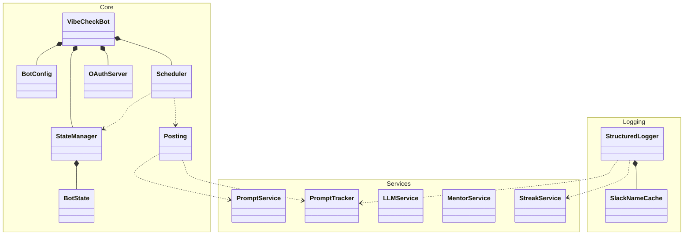
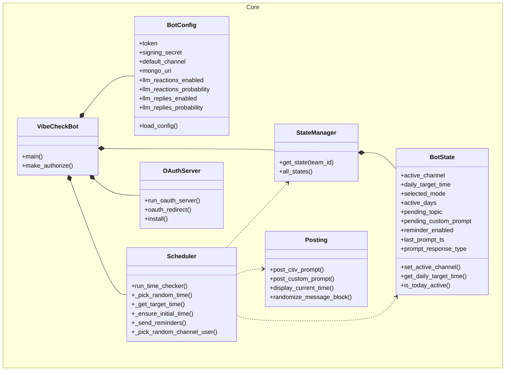
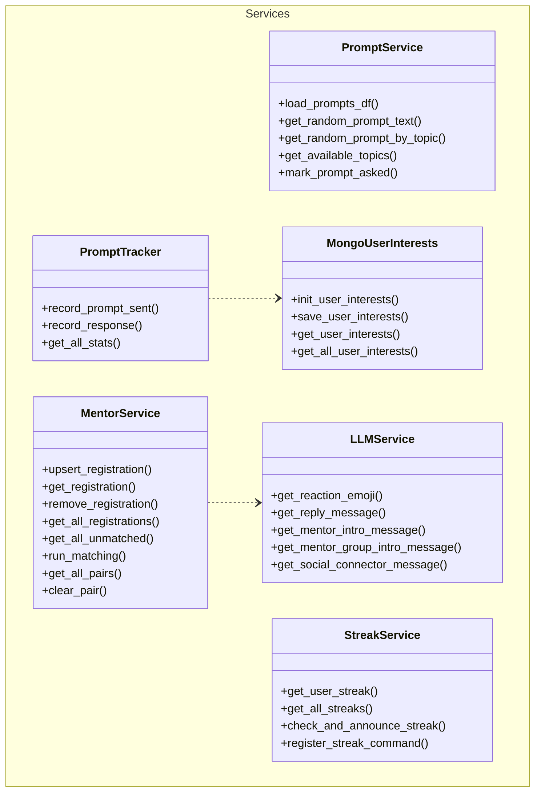
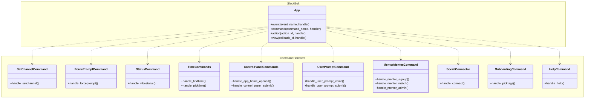

# Class Diagram

## __Overview__

```mermaid
classDiagram
direction TB
    namespace Core {
        class VibeCheckBot {
        }
        class BotConfig {
        }
        class StateManager {
        }
        class BotState {
        }
        class Scheduler {
        }
        class Posting {
        }
        class OAuthServer {
        }
    }

    namespace Services {
        class PromptService {
        }
        class PromptTracker {
        }
        class LLMService {
        }
        class MentorService {
        }
        class StreakService {
        }
    }

    namespace Logging {
        class StructuredLogger {
        }
        class SlackNameCache {
        }
    }

    VibeCheckBot *-- BotConfig
    VibeCheckBot *-- StateManager
    VibeCheckBot *-- Scheduler
    VibeCheckBot *-- OAuthServer

    StateManager *-- BotState

    Scheduler ..> StateManager
    Scheduler ..> Posting

    Posting ..> PromptService
    Posting ..> PromptTracker

    StructuredLogger *-- SlackNameCache
    StructuredLogger ..> PromptTracker
    StructuredLogger ..> StreakService
```

The overview shows the main pieces of VibeCheck. `VibeCheckBot` (main.py) initializes all components, registers every Slack Bolt command and event handler directly, and launches the background scheduler thread. The `StateManager` keeps one `BotState` per workspace, the services layer handles data persistence and AI interactions, and the logging layer records all message activity for analytics and streak tracking.

## __Core Component__

```mermaid
classDiagram
direction TB
    namespace Core {
        class VibeCheckBot {
            +main()
            +make_authorize()
        }

        class BotConfig {
            +token
            +signing_secret
            +default_channel
            +mongo_uri
            +llm_reactions_enabled
            +llm_reactions_probability
            +llm_replies_enabled
            +llm_replies_probability
            +load_config()
        }

        class StateManager {
            +get_state(team_id)
            +all_states()
        }

        class BotState {
            +active_channel
            +daily_target_time
            +selected_mode
            +active_days
            +pending_topic
            +pending_custom_prompt
            +reminder_enabled
            +last_prompt_ts
            +prompt_response_type
            +set_active_channel()
            +get_daily_target_time()
            +is_today_active()
        }

        class Scheduler {
            +run_time_checker()
            +_pick_random_time()
            +_get_target_time()
            +_ensure_initial_time()
            +_send_reminders()
            +_pick_random_channel_user()
        }

        class Posting {
            +post_csv_prompt()
            +post_custom_prompt()
            +display_current_time()
            +randomize_message_block()
        }

        class OAuthServer {
            +run_oauth_server()
            +oauth_redirect()
            +install()
        }
    }

    VibeCheckBot *-- BotConfig
    VibeCheckBot *-- StateManager
    VibeCheckBot *-- Scheduler
    VibeCheckBot *-- OAuthServer
    StateManager *-- BotState
    Scheduler ..> StateManager
    Scheduler ..> BotState
    Scheduler ..> Posting
```

The core component contains the bot's control flow. `VibeCheckBot` loads configuration, initializes the `StateManager`, registers all Slack Bolt handlers, and starts the scheduler thread. `StateManager` holds a thread-safe `BotState` instance per workspace so each team maintains its own channel, schedule, and feature flags. `OAuthServer` runs the Flask HTTP server that handles multi-workspace OAuth installs.

## __Services Component__

```mermaid
classDiagram
direction TB
    namespace Services {
        class PromptService {
            +load_prompts_df()
            +get_random_prompt_text()
            +get_random_prompt_by_topic()
            +get_available_topics()
            +mark_prompt_asked()
        }

        class PromptTracker {
            +record_prompt_sent()
            +record_response()
            +get_all_stats()
        }

        class MongoUserInterests {
            +init_user_interests()
            +save_user_interests()
            +get_user_interests()
            +get_all_user_interests()
        }

        class LLMService {
            +get_reaction_emoji()
            +get_reply_message()
            +get_mentor_intro_message()
            +get_mentor_group_intro_message()
            +get_social_connector_message()
        }

        class MentorService {
            +upsert_registration()
            +get_registration()
            +remove_registration()
            +get_all_registrations()
            +get_all_unmatched()
            +run_matching()
            +get_all_pairs()
            +clear_pair()
        }

        class StreakService {
            +get_user_streak()
            +get_all_streaks()
            +check_and_announce_streak()
            +register_streak_command()
        }
    }

    PromptTracker ..> MongoUserInterests
    MentorService ..> LLMService
```

The services component handles all external data and AI interactions. `PromptService` reads and caches the CSV prompt catalog. `PromptTracker` persists per-workspace prompt send and response counts in MongoDB. `MongoUserInterests` stores user interest tags for the social connector and mentor matching. `LLMService` calls the Groq API for emoji reactions, replies, and personalized introductions. `MentorService` manages the full mentor-mentee lifecycle in MongoDB. `StreakService` derives consecutive daily response streaks from the structured log file.

## __Slack Command and Event Wiring__

```mermaid
classDiagram
direction TB
    namespace SlackBolt {
        class App {
            +event(event_name, handler)
            +command(command_name, handler)
            +action(action_id, handler)
            +view(callback_id, handler)
        }
    }

    namespace CommandHandlers {
        class SetChannelCommand {
            +handle_setchannel()
        }
        class ForcePromptCommand {
            +handle_forceprompt()
        }
        class StatusCommand {
            +handle_vibestatus()
        }
        class TimeCommands {
            +handle_findtime()
            +handle_picktime()
        }
        class ControlPanelCommands {
            +handle_app_home_opened()
            +handle_control_panel_submit()
        }
        class UserPromptCommand {
            +handle_user_prompt_invite()
            +handle_user_prompt_submit()
        }
        class MentorMenteeCommand {
            +handle_mentor_signup()
            +handle_mentor_match()
            +handle_mentor_admin()
        }
        class SocialConnector {
            +handle_connect()
        }
        class OnboardingCommand {
            +handle_picktags()
        }
        class HelpCommand {
            +handle_help()
        }
    }

    App ..> SetChannelCommand
    App ..> ForcePromptCommand
    App ..> StatusCommand
    App ..> TimeCommands
    App ..> ControlPanelCommands
    App ..> UserPromptCommand
    App ..> MentorMenteeCommand
    App ..> SocialConnector
    App ..> OnboardingCommand
    App ..> HelpCommand
```

VibeCheck registers all command and event handlers directly with the Slack Bolt `App` instance — there is no adapter layer. Each handler module receives the Slack `client`, `body`, `ack`, and `say` objects directly from Bolt and calls into the services layer as needed.
