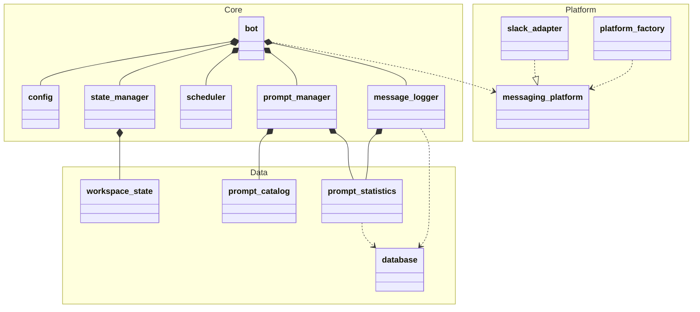
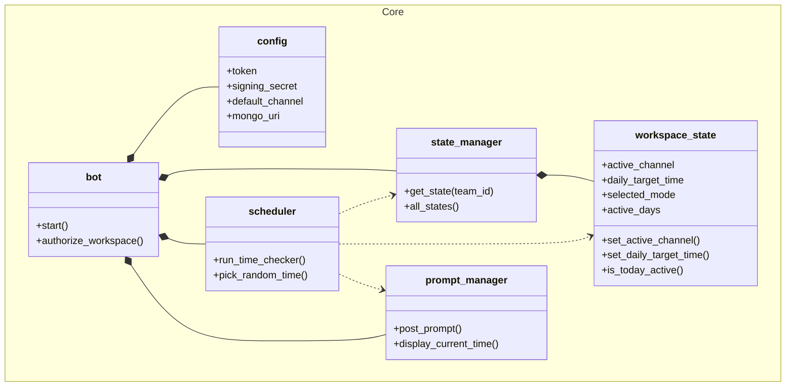
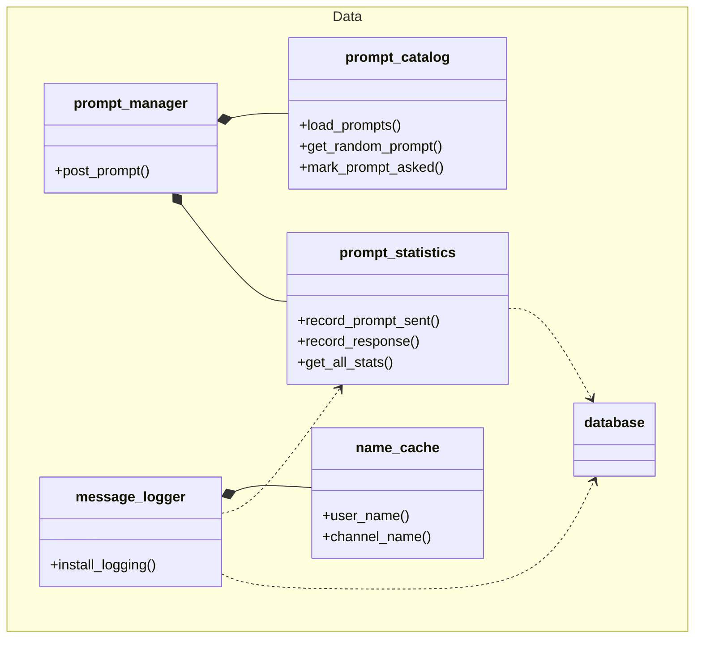
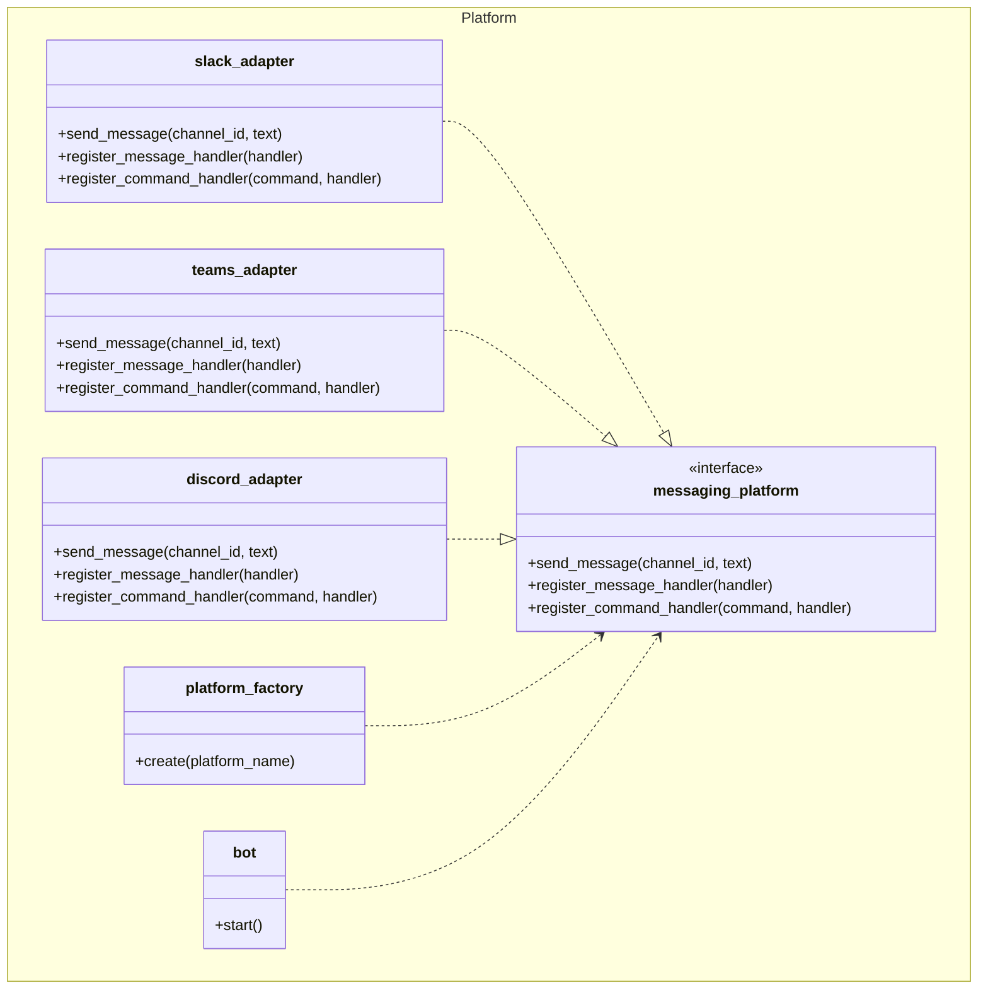

# Class Diagram

## __Overview__

```mermaid
classDiagram
direction TB
    namespace Core {
        class bot {
        }

        class config {
        }

        class state_manager {
        }

        class scheduler {
        }

        class prompt_manager {
        }

        class message_logger {
        }
    }

    namespace Data {
        class workspace_state {
        }

        class prompt_statistics {
        }

        class prompt_catalog {
        }

        class database {
        }
    }

    namespace Platform {
        class messaging_platform {
        }

        class slack_adapter {
        }

        class platform_factory {
        }
    }

    bot *-- config
    bot *-- state_manager
    bot *-- scheduler
    bot *-- prompt_manager
    bot *-- message_logger

    state_manager *-- workspace_state
    prompt_manager *-- prompt_catalog
    prompt_manager *-- prompt_statistics
    message_logger *-- prompt_statistics

    bot ..> messaging_platform
    platform_factory ..> messaging_platform
    slack_adapter ..|> messaging_platform
    message_logger ..> database
    prompt_statistics ..> database
```

The overview shows the main aspects of the project. The VibeCheck bot handles scheduling, prompt selection, logging, and workspace state within Slack. Within the data layer, it stores information regarding prompts and how often those prompts were used. As for the platform layer, it abstracts the messaging service so the design can support multiple platforms.

## __Core Component__

```mermaid
classDiagram
direction TB
    namespace Core {
        class bot {
            +start()
            +authorize_workspace()
        }

        class config {
            +token
            +signing_secret
            +default_channel
            +mongo_uri
        }

        class state_manager {
            +get_state(team_id)
            +all_states()
        }

        class workspace_state {
            +active_channel
            +daily_target_time
            +selected_mode
            +active_days
            +set_active_channel()
            +set_daily_target_time()
            +is_today_active()
        }

        class scheduler {
            +run_time_checker()
            +pick_random_time()
        }

        class prompt_manager {
            +post_prompt()
            +display_current_time()
        }
    }

    bot *-- config
    bot *-- state_manager
    bot *-- scheduler
    bot *-- prompt_manager
    state_manager *-- workspace_state
    scheduler ..> state_manager
    scheduler ..> workspace_state
    scheduler ..> prompt_manager
```

The core component contains the main operation of the project. The bot loads configuration, creates and manages shared services, and starts the scheduler. The state_manager keeps one workspace_state for each Slack workspace, and the scheduler uses that state to decide when prompts should be sent.

## __Data Component__

```mermaid
classDiagram
direction TB
    namespace Data {
        class prompt_manager {
            +post_prompt()
        }

        class prompt_catalog {
            +load_prompts()
            +get_random_prompt()
            +mark_prompt_asked()
        }

        class prompt_statistics {
            +record_prompt_sent()
            +record_response()
            +get_all_stats()
        }

        class message_logger {
            +install_logging()
        }

        class name_cache {
            +user_name()
            +channel_name()
        }

        class database {
        }
    }

    prompt_manager *-- prompt_catalog
    prompt_manager *-- prompt_statistics
    message_logger *-- name_cache
    message_logger ..> prompt_statistics
    message_logger ..> database
    prompt_statistics ..> database
```

The data component focuses on storing prompts, prompt statistics, and message logs within workspaces. The prompt_catalog reads the CSV prompt data, which stores runtime statistics into MongoDB through prompt_statistics. Additionally, message_logger stores message activity while also updating prompt response counts.

## __Multi-Platform Pattern__

```mermaid
classDiagram
direction TB
    namespace Platform {
        class messaging_platform {
            <<interface>>
            +send_message(channel_id, text)
            +register_message_handler(handler)
            +register_command_handler(command, handler)
        }

        class slack_adapter {
            +send_message(channel_id, text)
            +register_message_handler(handler)
            +register_command_handler(command, handler)
        }

        class teams_adapter {
            +send_message(channel_id, text)
            +register_message_handler(handler)
            +register_command_handler(command, handler)
        }

        class discord_adapter {
            +send_message(channel_id, text)
            +register_message_handler(handler)
            +register_command_handler(command, handler)
        }

        class platform_factory {
            +create(platform_name)
        }

        class bot {
            +start()
        }
    }

    slack_adapter ..|> messaging_platform
    teams_adapter ..|> messaging_platform
    discord_adapter ..|> messaging_platform
    platform_factory ..> messaging_platform
    bot ..> messaging_platform
```

This is our conceptual design for making VibeCheck platform-agnostic. The bot depends on a general messaging_platform interface instead of depending on a single messaging SDK. Currently, Slack is the only platform, but the same bot logic could later be connected to Teams or Discord by adding another adapter.
