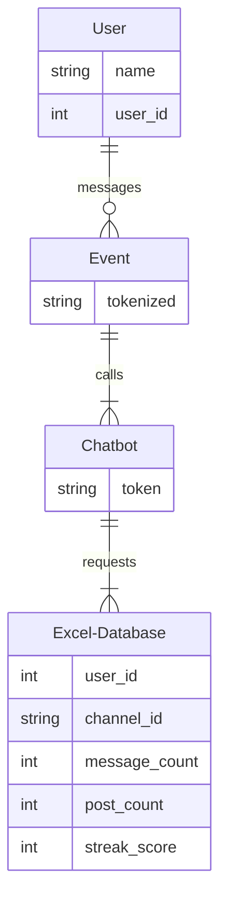

## Components & Interface Overview

VibeCheck is a BeReal-like chatbot project. Since this project is primarily about the bot itself being used in an external application (Slack), its components consist of a prompt manager, scheduler, event handler, and an Excel database. All components are interfaced through the usage of the Slack API.

#### Excel Database (Component)

The excel database stores message history, post history, timestamps, responsiveness to certain topics, generated prompts, and relevant logs. 

The data will then be used to give users a timeline of all their posts, a streak score history, and allows the chatbot to create group discussions based on the most interactive topics 

#### Prompt Manager (Component)

The prompt manager will load a collection of prompts from the excel database that are each categorized by topic. The prompt will be randomly selected from the database to provide a diverse range of interesting questions.

Based on the prompt's topic, if the prompt itself attracted high activity rates, the engagement manager will increase the likelihood of selecting that same topic.

#### Scheduler (Component)

The scheduler sends out time-regulated prompts and messages.

#### Event Handler (Component)

The event handler analyzes and handles multiple user requests, user messages, posts, and commands.

#### Slack API [The Interface]

The Slack API is what connects the chatbot to Slack. The API handles and verifies message posting, event delivery, and other calls from the bot before sending. 

## Algorithms

Algorithms employed in VibeCheck consists of Message counting, prompt selection, and post timing.

#### Message Counting

Message counting tracks how many messages were sent by a user within a channel. The user id is inputted to the algorithm, which provides the number of responses from that user. Slack has a conversation.history call, which provides up to 200 previous messages the user had made. 

#### Prompt Selection

Prompt selection is how the chabot will pick prompts from the excel database. the chatbot will load the prompts from Excel, which it will then randomly select a topic and pick a prompt from the database. 

#### Post Timing

 Post timing determines when prompts and messages are sent to the channel. It's employed by having a function that selects a random time, roughly between the morning and early afternoon, which is the default setting for when prompts are sent out. This can be customized by the administrator running the channel. 

## Entity-Relation Diagram.

##### User Table

- stores the user's information, such as their username and user_id

##### Event Table

- Contains a tokenized string of characters from a message sent by the user

##### Chatbot Table

- chatbot reads the tokenized string and pulls necessary data from the Excel Spreadsheet

##### Excel-Database Table

- the database provides the stored information to the chatbot
