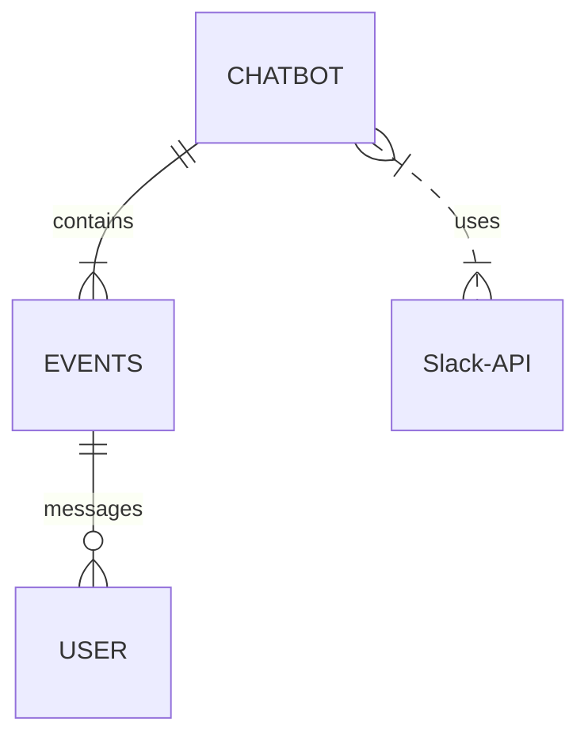

## Components & Interfaces 
VibeCheck is BeReal chatbot composed of an excel database, a prompt manager, scheduler, event handler, and the Slack API. 

The Excel Database stores message history, post history, timestamps, responsiveness to certain topics, and other relevant data. 

The prompt manager will have a collection of prompts within an excel spreadsheet that are labeled by topic. It interfaces with the chatbot to provision prompts through requests. 

The scheduler processes multiple user requests, timed prompts, and time of posts. The scheduler interfaces with the Excel Database, the Slack API, and event handler to provide details of when a user submitted their posts, which affects their streak score. Whenever the chatbot wants to send a message or a prompt, it calls the Slack API and then Slack will deliver it.

The event handler analyzes user messages to keep track of streaks, post history, and conversation history. The event handler interfaces with the Slack API to make calls.

The Slack API is what connects the chatbot to Slack. The API handles and verifies message posting, event delivery, and other calls from the bot before sending. 

## Algorithms
Algorithms employed in VibeCheck consists of Message counting, prompt selection, and post timing. Message counting tracks how many messages were sent by a user within a channel. The user id is inputted to the algorithm, which provides the number of responses from that user. Slack has a conversation.history call, which provides up to 200 previous messages the user had made. Prompt selection is how the chabot will pick prompts from the excel database. the chatbot will load the prompts from Excel, which it will then randomly select a topic and pick a prompt from the database. Post timing determines when prompts and messages are sent to the channel. It's employed by having a function that selects a random time, roughly between the morning and early afternoon, which is the default setting for when prompts are sent out. This can be customized by the administrator running the channel. 

## Entity-Relation Diagram.

