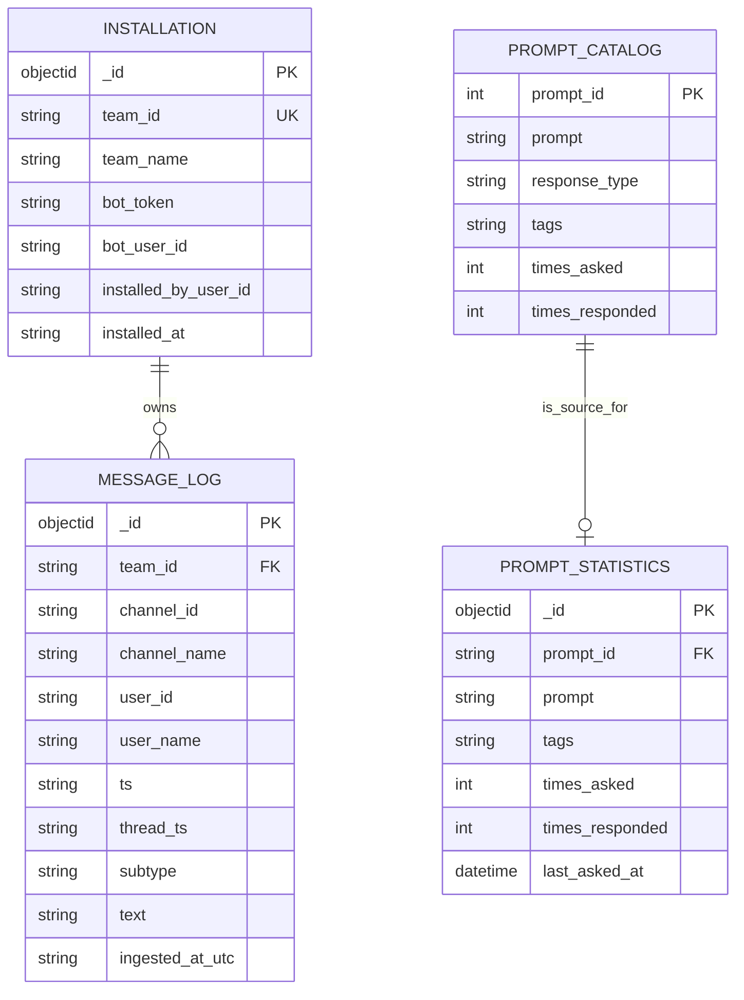

## Components & Interface Overview

VibeCheck is a BeReal-like chatbot project. Since this project is primarily about the bot itself being used in an external application (Slack), its components consist of a prompt manager, scheduler, event handler, and MongoDB as its database. All components are interfaced through the usage of the Slack API.

### Component Interfaces

- Client: Slack workspace users interacting through channel messages, slash commands, and interactive controls.
- Server: Python Slack Bolt app that receives Slack events and commands, executes scheduling and prompt logic, and posts responses back to Slack.
- OAuth/HTTP Layer: Flask endpoints for Slack install and OAuth redirect flows.
- Database: MongoDB for runtime operational state and analytics data.
- Prompt Catalog Storage: CSV file used as the source prompt dataset.

#### Interface Contracts

- Slack to Server:
    - Incoming message events for response counting and logging.
    - Slash commands (for example prompt stats, status/time controls).
    - Interactive control panel actions.
- Server to Slack:
    - chat.postMessage for scheduled prompts, operational messages, and command responses.
- Server to MongoDB:
    - Upsert installation records by team id.
    - Insert message documents into per-workspace message collections.
    - Upsert and increment prompt usage statistics in prompt_stats.
- Server to Prompt Catalog CSV:
    - Read prompts for random prompt selection.
    - Optional write-back for asked timestamps when supported by CSV columns.

#### MongoDB Database (Component)

MongoDB stores runtime operational data, including workspace installations, per-workspace message logs, and prompt usage statistics.

The main collections are `installations`, `prompt_stats`, and dynamic `messages_<team_name|team_id>` collections. These records support Slack authorization, analytics commands (such as prompt stats), and response tracking.

#### Prompt Manager (Component)

The prompt manager loads prompts from a CSV catalog (`data/prompts/vibecheck_prompts.csv`) and randomly selects a prompt, optionally filtered by response type.

When a prompt is posted, the bot records ask/response activity in MongoDB (`prompt_stats`) so operators can inspect engagement over time.

#### Scheduler (Component)

The scheduler sends out time-regulated prompts and messages.

#### Event Handler (Component)

The event handler analyzes and handles multiple user requests, user messages, posts, and commands.

#### Slack API [The Interface]

The Slack API is what connects the chatbot to Slack. The API handles and verifies message posting, event delivery, and other calls from the bot before sending. 

## Algorithms

Algorithms employed in VibeCheck consists of Message counting, prompt selection, and post timing.

#### Message Counting

Message counting tracks user responses to the currently active prompt in each channel. After a prompt is posted, each qualifying incoming message increments `times_responded` for that prompt in MongoDB.

#### Prompt Selection

Prompt selection is performed by loading the prompt catalog CSV into memory and sampling a random row. The system normalizes column names and supports optional filtering by `response_type` when that field is available.

#### Post Timing

 Post timing determines when prompts and messages are sent to the channel. It's employed by having a function that selects a random time, roughly between the morning and early afternoon, which is the default setting for when prompts are sent out. This can be customized by the administrator running the channel. 

## Entity-Relation Diagram.

```mermaid
erDiagram
    INSTALLATION ||--o{ MESSAGE_LOG : owns
    PROMPT_CATALOG ||--o| PROMPT_STATISTICS : is_source_for

    INSTALLATION {
        objectid _id PK
        string team_id UK
        string team_name
        string bot_token
        string bot_user_id
        string installed_by_user_id
        string installed_at
    }

    MESSAGE_LOG {
        objectid _id PK
        string team_id FK
        string channel_id
        string channel_name
        string user_id
        string user_name
        string ts
        string thread_ts
        string subtype
        string text
        string ingested_at_utc
    }

    PROMPT_CATALOG {
        int prompt_id PK
        string prompt
        string response_type
        string tags
        int times_asked
        int times_responded
    }

    PROMPT_STATISTICS {
        objectid _id PK
        string prompt_id FK
        string prompt
        string tags
        int times_asked
        int times_responded
        datetime last_asked_at
    }
```

##### Installation Collection (`vibecheck.installations`)

- Stores one Slack workspace installation per `team_id`, including bot credentials and install metadata.

##### Message Log Collections (`vibecheck.messages_<team_name|team_id>`)

- Stores ingested Slack message events.
- Each message document belongs to a workspace via `team_id`.
- Collection name is dynamic per workspace (`messages_<team_name>` when available, otherwise `messages_<team_id>`).

##### Prompt Catalog (CSV: `data/prompts/vibecheck_prompts.csv`)

- Source dataset for prompt selection.
- Contains prompt metadata used by the bot when posting prompts.

##### Prompt Stats Collection (`vibecheck.prompt_stats`)

- Aggregated runtime stats keyed by `prompt_id`.
- Updated whenever a prompt is posted (`times_asked`) and when users respond in the active channel (`times_responded`).

## Table Design

This section defines the implemented physical data design for MongoDB collections and the CSV prompt catalog.

### Collection: `vibecheck.installations`

| Field | Type | Required | Key/Constraint | Description |
|---|---|---|---|---|
| _id | ObjectId | Yes | Primary (Mongo default) | MongoDB document id. |
| team_id | String | Yes | Unique (application-level upsert key) | Slack workspace/team identifier. |
| team_name | String | Yes | None | Human-readable Slack workspace name. |
| bot_token | String | Yes | Sensitive | Bot OAuth token used for workspace authorization. |
| bot_user_id | String | No | None | Bot user id returned by Slack OAuth. |
| installed_by_user_id | String | No | None | Installer Slack user id. |
| installed_at | String (ISO-8601 UTC) | Yes | None | Install timestamp. |

### Collection Family: `vibecheck.messages_<team_name|team_id>`

| Field | Type | Required | Key/Constraint | Description |
|---|---|---|---|---|
| _id | ObjectId | Yes | Primary (Mongo default) | MongoDB document id. |
| team_id | String | No | Logical FK to installations.team_id | Workspace id for this event. |
| channel_id | String | No | None | Slack channel id. |
| channel_name | String | No | None | Cached channel name at ingest time. |
| user_id | String | No | None | Slack user id for sender. |
| user_name | String | No | None | Cached user display name at ingest time. |
| ts | String | No | None | Slack event timestamp. |
| thread_ts | String | No | None | Slack thread root timestamp when present. |
| subtype | String | No | None | Slack message subtype when present. |
| text | String | No | None | Message text payload. |
| ingested_at_utc | String (ISO-8601 UTC) | Yes | None | Ingestion timestamp. |

### Collection: `vibecheck.prompt_stats`

| Field | Type | Required | Key/Constraint | Description |
|---|---|---|---|---|
| _id | ObjectId | Yes | Primary (Mongo default) | MongoDB document id. |
| prompt_id | String | Yes | Upsert key (application-level) | Prompt identifier from prompt catalog. |
| prompt | String | Yes | None | Prompt text snapshot. |
| tags | Array[String] | No | None | Normalized tag list derived from CSV tags. |
| times_asked | Integer | Yes | Non-negative counter | Incremented when prompt is posted. |
| times_responded | Integer | Yes | Non-negative counter | Incremented on qualifying user responses. |
| last_asked_at | DateTime (UTC) | No | None | Last time prompt was posted. |

### File Dataset: `data/prompts/vibecheck_prompts.csv`

| Column | Type | Required | Key/Constraint | Description |
|---|---|---|---|---|
| prompt_id | Integer | Yes | Logical primary key in dataset | Prompt identifier used by runtime and stats mapping. |
| prompt | String | Yes | None | Prompt text shown to users. |
| response_type | String | No | Domain values such as text/image | Used for optional prompt filtering. |
| tags | String (comma-separated) | No | None | Topic tags used for analytics and grouping. |
| times_asked | Integer | No | Non-negative recommended | Dataset-level counter field. |
| times_responded | Integer | No | Non-negative recommended | Dataset-level counter field. |

### Data Integrity Notes

- Relationship from messages to installations is enforced by team_id usage in application logic, not a MongoDB foreign key constraint.
- Relationship from prompt_stats to prompt catalog is enforced by prompt_id values generated from the CSV dataset.
- Prompt tags are stored as comma-separated strings in CSV and normalized into arrays in MongoDB prompt_stats.
