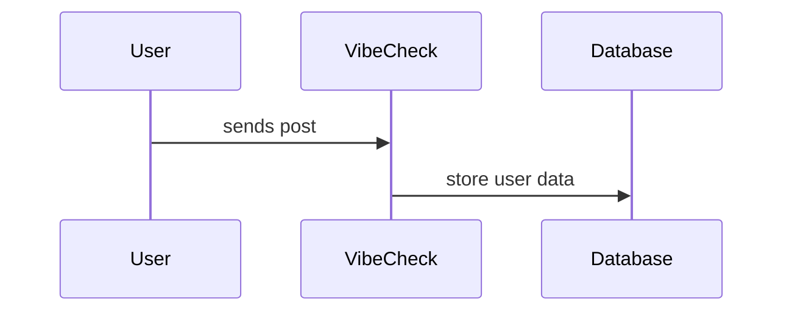
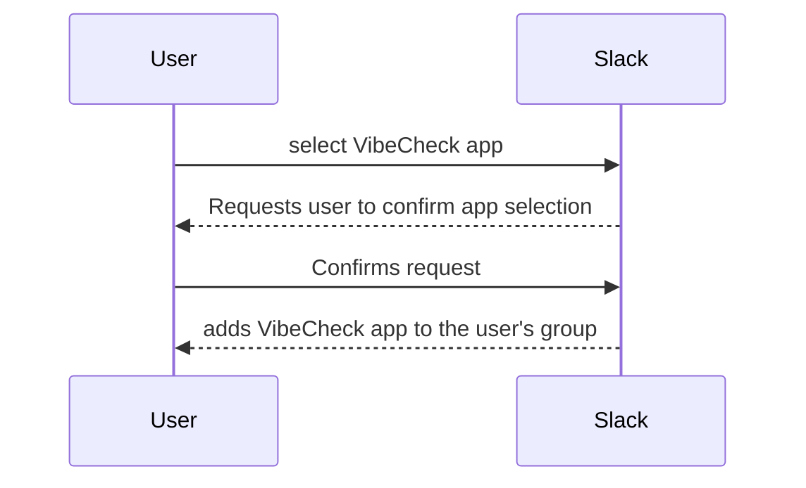
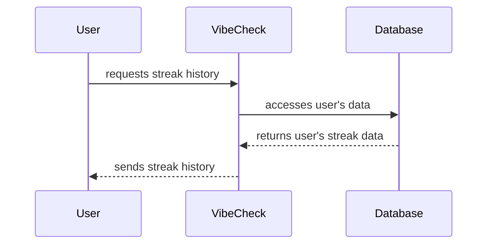
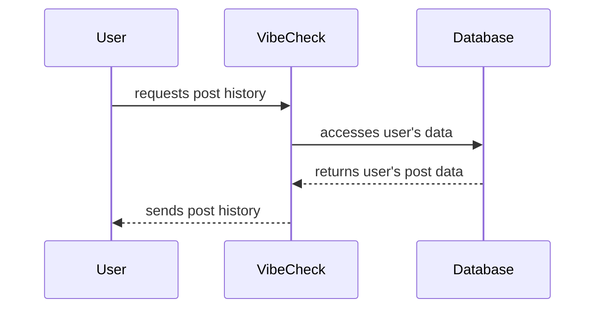
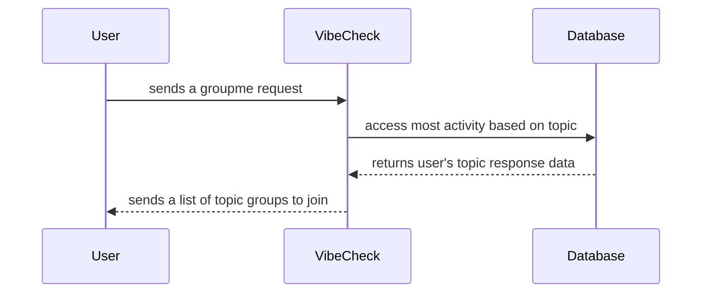

# sequence diagrams 

#### Use Case 1: Reply

#### Use Case 2: Personal Use

#### Use Case 3: User Prompts

#### Use Case 4: Streak History

#### Use Case 5: Post History

#### Use Case 6: Peer Connection
