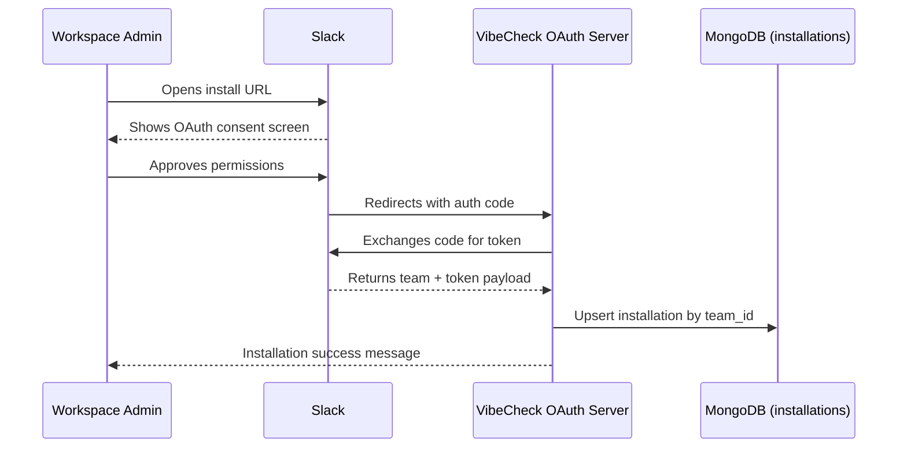
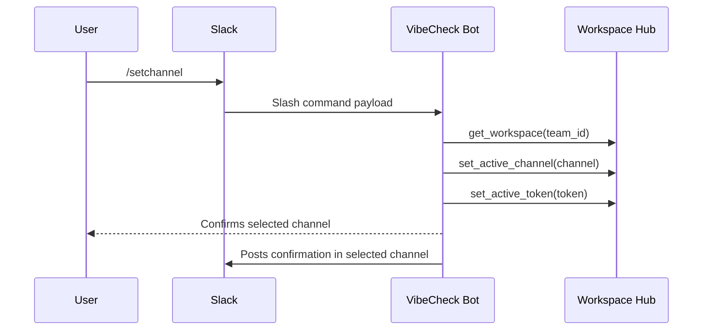
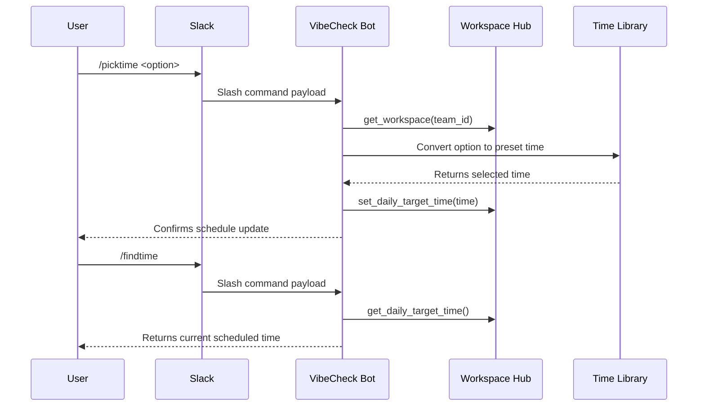
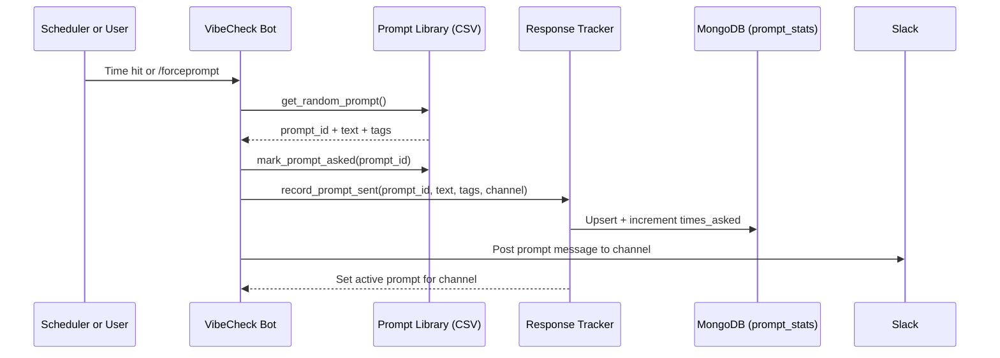
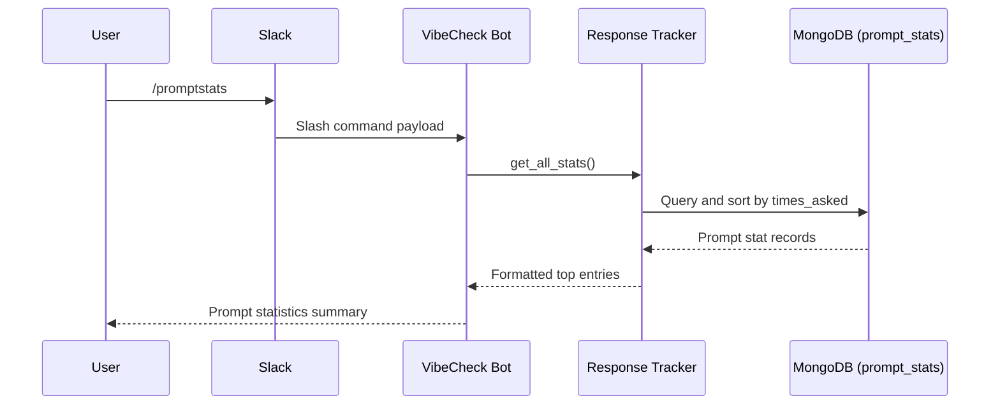

# sequence diagrams 

#### Use Case 1: Installing Bot in a Slack Workspace

```mermaid
sequenceDiagram
    participant Admin as Workspace Admin
    participant Slack
    participant OAuth as VibeCheck OAuth Server
    participant DB as MongoDB (installations)

    Admin->>Slack: Opens install URL
    Slack-->>Admin: Shows OAuth consent screen
    Admin->>Slack: Approves permissions
    Slack->>OAuth: Redirects with auth code
    OAuth->>Slack: Exchanges code for token
    Slack-->>OAuth: Returns team + token payload
    OAuth->>DB: Upsert installation by team_id
    OAuth-->>Admin: Installation success message
```

#### Use Case 2: Setting Active Channel

```mermaid
sequenceDiagram
    participant User
    participant Slack
    participant Bot as VibeCheck Bot
    participant Hub as Workspace Hub

    User->>Slack: /setchannel #channel-name
    Slack->>Bot: Slash command payload
    Bot->>Hub: get_workspace(team_id)
    Bot->>Hub: set_active_channel(channel)
    Bot->>Hub: set_active_token(token)
    Bot-->>User: Confirms selected channel
    Bot->>Slack: Posts confirmation in selected channel
```

#### Use Case 3: Configuring Prompt Time

```mermaid
sequenceDiagram
    participant User
    participant Slack
    participant Bot as VibeCheck Bot
    participant Hub as Workspace Hub
    participant TimeLib as Time Library

    User->>Slack: /picktime <option>
    Slack->>Bot: Slash command payload
    Bot->>Hub: get_workspace(team_id)
    Bot->>TimeLib: Convert option to preset time
    TimeLib-->>Bot: Returns selected time
    Bot->>Hub: set_daily_target_time(time)
    Bot-->>User: Confirms schedule update

    User->>Slack: /findtime
    Slack->>Bot: Slash command payload
    Bot->>Hub: get_daily_target_time()
    Bot-->>User: Returns current scheduled time
```

#### Use Case 4: Sending Prompt

```mermaid
sequenceDiagram
    participant Trigger as Scheduler or User
    participant Bot as VibeCheck Bot
    participant Catalog as Prompt Library (CSV)
    participant Tracker as Response Tracker
    participant DB as MongoDB (prompt_stats)
    participant Slack

    Trigger->>Bot: Time hit or /forceprompt
    Bot->>Catalog: get_random_prompt()
    Catalog-->>Bot: prompt_id + text + tags
    Bot->>Catalog: mark_prompt_asked(prompt_id)
    Bot->>Tracker: record_prompt_sent(prompt_id, text, tags, channel)
    Tracker->>DB: Upsert + increment times_asked
    Bot->>Slack: Post prompt message to channel
    Tracker-->>Bot: Set active prompt for channel
```

#### Use Case 5: Viewing Prompt Statistics

```mermaid
sequenceDiagram
    participant User
    participant Slack
    participant Bot as VibeCheck Bot
    participant Tracker as Response Tracker
    participant DB as MongoDB (prompt_stats)

    User->>Slack: /promptstats
    Slack->>Bot: Slash command payload
    Bot->>Tracker: get_all_stats()
    Tracker->>DB: Query and sort by times_asked
    DB-->>Tracker: Prompt stat records
    Tracker-->>Bot: Formatted top entries
    Bot-->>User: Prompt statistics summary
```