# sequence diagrams 

#### Use Case 1: Installing Bot in a Slack Workspace

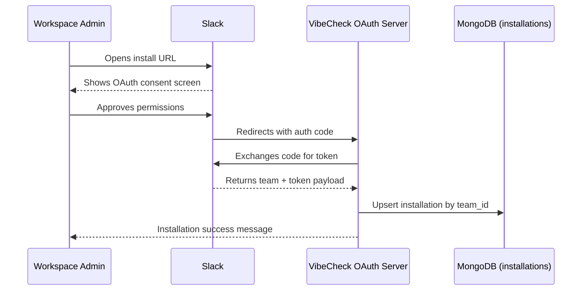
```mermaid
sequenceDiagram
    participant Admin as Workspace Admin
    participant Slack
    participant OAuth as VibeCheck OAuth Server
    participant DB as MongoDB (installations)

    Admin->>Slack: Opens install URL
    Slack-->>Admin: Shows OAuth consent screen
    Admin->>Slack: Approves permissions
    Slack->>OAuth: Redirects with auth code
    OAuth->>Slack: Exchanges code for token
    Slack-->>OAuth: Returns team + token payload
    OAuth->>DB: Upsert installation by team_id
    OAuth-->>Admin: Installation success message
```

#### Use Case 2: Setting Active Channel

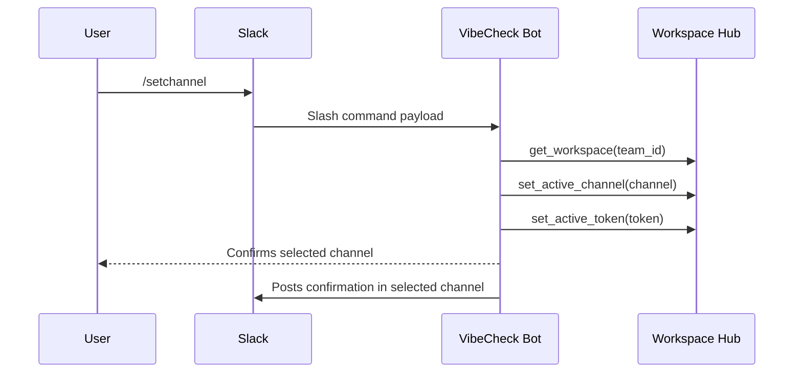
```mermaid
sequenceDiagram
    participant User
    participant Slack
    participant Bot as VibeCheck Bot
    participant Hub as Workspace Hub

    User->>Slack: /setchannel #channel-name
    Slack->>Bot: Slash command payload
    Bot->>Hub: get_workspace(team_id)
    Bot->>Hub: set_active_channel(channel)
    Bot->>Hub: set_active_token(token)
    Bot-->>User: Confirms selected channel
    Bot->>Slack: Posts confirmation in selected channel
```

#### Use Case 3: Configuring Prompt Time

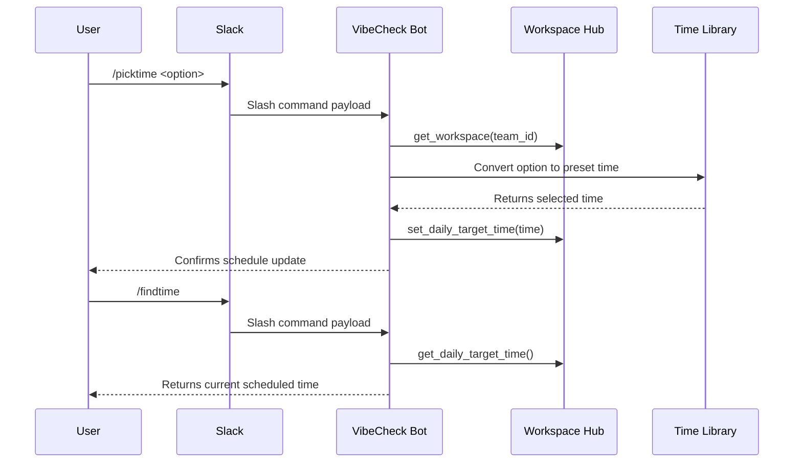
```mermaid
sequenceDiagram
    participant User
    participant Slack
    participant Bot as VibeCheck Bot
    participant Hub as Workspace Hub
    participant TimeLib as Time Library

    User->>Slack: /picktime <option>
    Slack->>Bot: Slash command payload
    Bot->>Hub: get_workspace(team_id)
    Bot->>TimeLib: Convert option to preset time
    TimeLib-->>Bot: Returns selected time
    Bot->>Hub: set_daily_target_time(time)
    Bot-->>User: Confirms schedule update

    User->>Slack: /findtime
    Slack->>Bot: Slash command payload
    Bot->>Hub: get_daily_target_time()
    Bot-->>User: Returns current scheduled time
```

#### Use Case 4: Sending Prompt

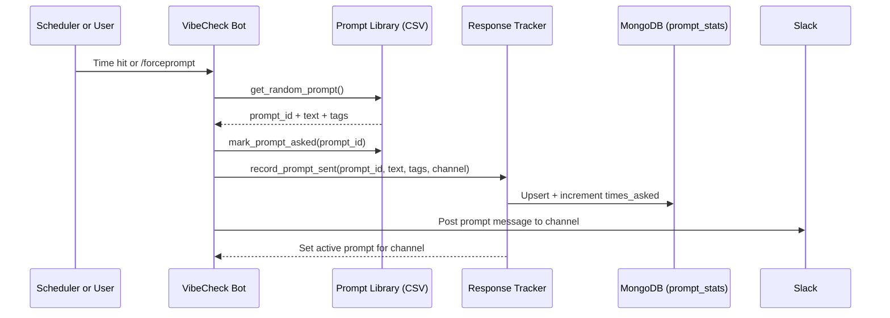
```mermaid
sequenceDiagram
    participant Trigger as Scheduler or User
    participant Bot as VibeCheck Bot
    participant Catalog as Prompt Library (CSV)
    participant Tracker as Response Tracker
    participant DB as MongoDB (prompt_stats)
    participant Slack

    Trigger->>Bot: Time hit or /forceprompt
    Bot->>Catalog: get_random_prompt()
    Catalog-->>Bot: prompt_id + text + tags
    Bot->>Catalog: mark_prompt_asked(prompt_id)
    Bot->>Tracker: record_prompt_sent(prompt_id, text, tags, channel)
    Tracker->>DB: Upsert + increment times_asked
    Bot->>Slack: Post prompt message to channel
    Tracker-->>Bot: Set active prompt for channel
```

#### Use Case 5: Viewing Prompt Statistics

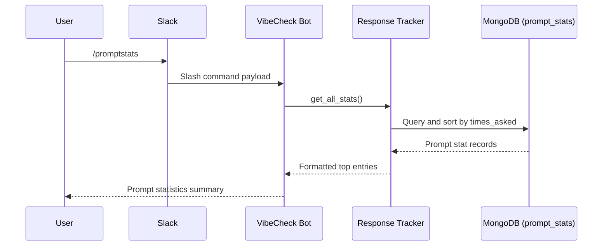
```mermaid
sequenceDiagram
    participant User
    participant Slack
    participant Bot as VibeCheck Bot
    participant Tracker as Response Tracker
    participant DB as MongoDB (prompt_stats)

    User->>Slack: /promptstats
    Slack->>Bot: Slash command payload
    Bot->>Tracker: get_all_stats()
    Tracker->>DB: Query and sort by times_asked
    DB-->>Tracker: Prompt stat records
    Tracker-->>Bot: Formatted top entries
    Bot-->>User: Prompt statistics summary
```

#### Use Case 6: Configuring the Bot via the Control Panel

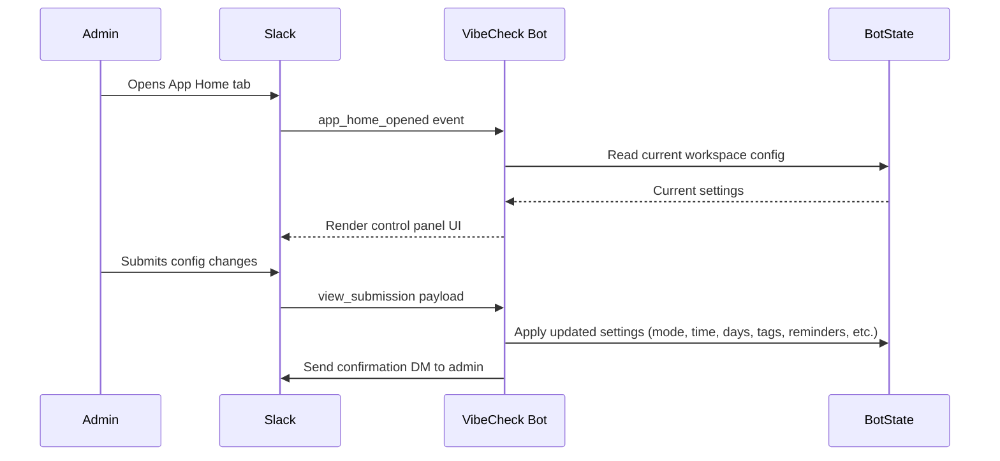
```mermaid
sequenceDiagram
    participant Admin
    participant Slack
    participant Bot as VibeCheck Bot
    participant State as BotState

    Admin->>Slack: Opens App Home tab
    Slack->>Bot: app_home_opened event
    Bot->>State: Read current workspace config
    State-->>Bot: Current settings
    Bot-->>Slack: Render control panel UI

    Admin->>Slack: Submits config changes
    Slack->>Bot: view_submission payload
    Bot->>State: Apply updated settings (mode, time, days, tags, reminders, etc.)
    Bot->>Slack: Send confirmation DM to admin
```

#### Use Case 7: User-Created Prompt Invitation

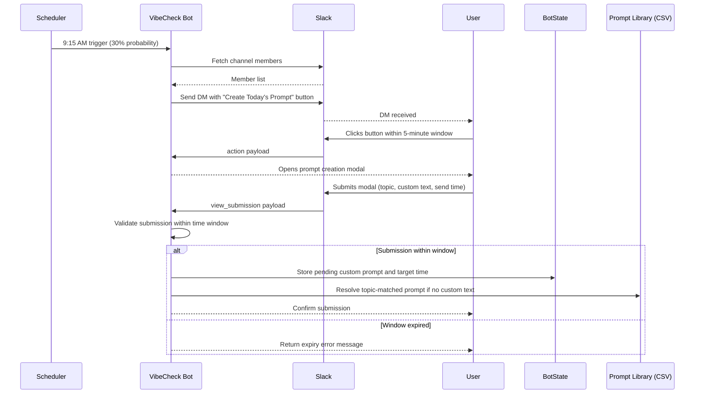
```mermaid
sequenceDiagram
    participant Scheduler
    participant Bot as VibeCheck Bot
    participant Slack
    participant User
    participant State as BotState
    participant Catalog as Prompt Library (CSV)

    Scheduler->>Bot: 9:15 AM trigger (30% probability)
    Bot->>Slack: Fetch channel members
    Slack-->>Bot: Member list
    Bot->>Slack: Send DM with "Create Today's Prompt" button
    Slack-->>User: DM received

    User->>Slack: Clicks button within 5-minute window
    Slack->>Bot: action payload
    Bot-->>User: Opens prompt creation modal

    User->>Slack: Submits modal (topic, custom text, send time)
    Slack->>Bot: view_submission payload
    Bot->>Bot: Validate submission within time window
    alt Submission within window
        Bot->>State: Store pending custom prompt and target time
        Bot->>Catalog: Resolve topic-matched prompt if no custom text
        Bot-->>User: Confirm submission
    else Window expired
        Bot-->>User: Return expiry error message
    end
```

#### Use Case 8: Tracking Response Streaks

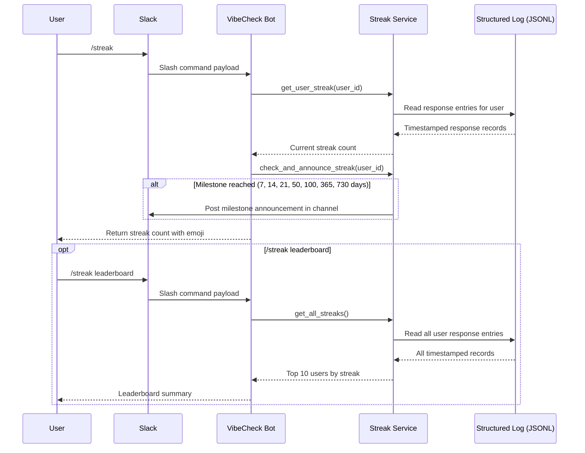
```mermaid
sequenceDiagram
    participant User
    participant Slack
    participant Bot as VibeCheck Bot
    participant StreakSvc as Streak Service
    participant LogFile as Structured Log (JSONL)

    User->>Slack: /streak
    Slack->>Bot: Slash command payload
    Bot->>StreakSvc: get_user_streak(user_id)
    StreakSvc->>LogFile: Read response entries for user
    LogFile-->>StreakSvc: Timestamped response records
    StreakSvc-->>Bot: Current streak count
    Bot->>StreakSvc: check_and_announce_streak(user_id)
    alt Milestone reached (7, 14, 21, 50, 100, 365, 730 days)
        StreakSvc->>Slack: Post milestone announcement in channel
    end
    Bot-->>User: Return streak count with emoji

    opt /streak leaderboard
        User->>Slack: /streak leaderboard
        Slack->>Bot: Slash command payload
        Bot->>StreakSvc: get_all_streaks()
        StreakSvc->>LogFile: Read all user response entries
        LogFile-->>StreakSvc: All timestamped records
        StreakSvc-->>Bot: Top 10 users by streak
        Bot-->>User: Leaderboard summary
    end
```

#### Use Case 9: Social Connector

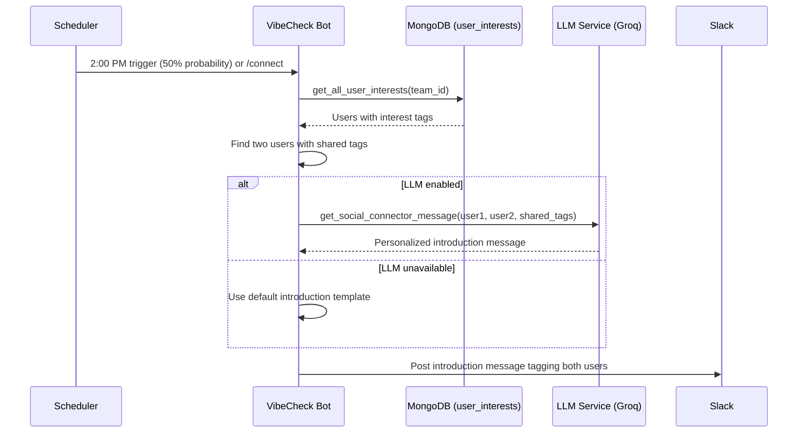
```mermaid
sequenceDiagram
    participant Scheduler
    participant Bot as VibeCheck Bot
    participant DB as MongoDB (user_interests)
    participant LLM as LLM Service (Groq)
    participant Slack

    Scheduler->>Bot: 2:00 PM trigger (50% probability) or /connect
    Bot->>DB: get_all_user_interests(team_id)
    DB-->>Bot: Users with interest tags
    Bot->>Bot: Find two users with shared tags
    alt LLM enabled
        Bot->>LLM: get_social_connector_message(user1, user2, shared_tags)
        LLM-->>Bot: Personalized introduction message
    else LLM unavailable
        Bot->>Bot: Use default introduction template
    end
    Bot->>Slack: Post introduction message tagging both users
```

#### Use Case 10: Mentor-Mentee Program

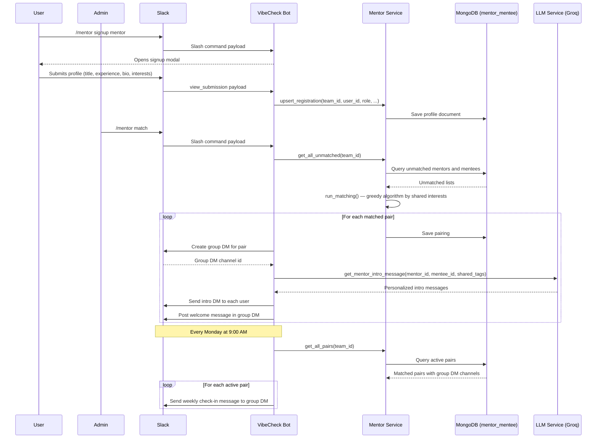
```mermaid
sequenceDiagram
    participant User
    participant Admin
    participant Slack
    participant Bot as VibeCheck Bot
    participant MentorSvc as Mentor Service
    participant DB as MongoDB (mentor_mentee)
    participant LLM as LLM Service (Groq)

    User->>Slack: /mentor signup mentor
    Slack->>Bot: Slash command payload
    Bot-->>User: Opens signup modal
    User->>Slack: Submits profile (title, experience, bio, interests)
    Slack->>Bot: view_submission payload
    Bot->>MentorSvc: upsert_registration(team_id, user_id, role, ...)
    MentorSvc->>DB: Save profile document

    Admin->>Slack: /mentor match
    Slack->>Bot: Slash command payload
    Bot->>MentorSvc: get_all_unmatched(team_id)
    MentorSvc->>DB: Query unmatched mentors and mentees
    DB-->>MentorSvc: Unmatched lists
    MentorSvc->>MentorSvc: run_matching() — greedy algorithm by shared interests
    loop For each matched pair
        MentorSvc->>DB: Save pairing
        Bot->>Slack: Create group DM for pair
        Slack-->>Bot: Group DM channel id
        Bot->>LLM: get_mentor_intro_message(mentor_id, mentee_id, shared_tags)
        LLM-->>Bot: Personalized intro messages
        Bot->>Slack: Send intro DM to each user
        Bot->>Slack: Post welcome message in group DM
    end

    Note over Bot,Slack: Every Monday at 9:00 AM
    Bot->>MentorSvc: get_all_pairs(team_id)
    MentorSvc->>DB: Query active pairs
    DB-->>MentorSvc: Matched pairs with group DM channels
    loop For each active pair
        Bot->>Slack: Send weekly check-in message to group DM
    end
```

#### Use Case 11: Late Response Reminders

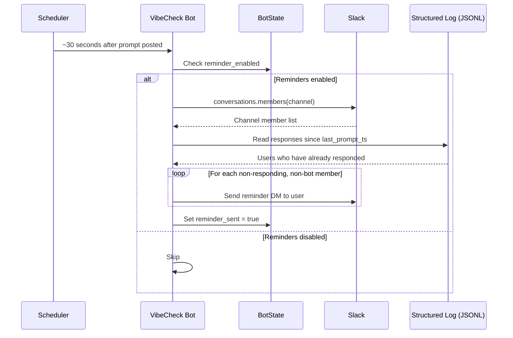
```mermaid
sequenceDiagram
    participant Scheduler
    participant Bot as VibeCheck Bot
    participant State as BotState
    participant Slack
    participant LogFile as Structured Log (JSONL)

    Scheduler->>Bot: ~30 seconds after prompt posted
    Bot->>State: Check reminder_enabled
    alt Reminders enabled
        Bot->>Slack: conversations.members(channel)
        Slack-->>Bot: Channel member list
        Bot->>LogFile: Read responses since last_prompt_ts
        LogFile-->>Bot: Users who have already responded
        loop For each non-responding, non-bot member
            Bot->>Slack: Send reminder DM to user
        end
        Bot->>State: Set reminder_sent = true
    else Reminders disabled
        Bot->>Bot: Skip
    end
```

#### Use Case 12: AI-Powered Reactions and Replies

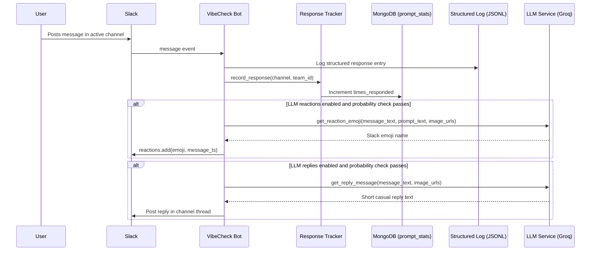
```mermaid
sequenceDiagram
    participant User
    participant Slack
    participant Bot as VibeCheck Bot
    participant Tracker as Response Tracker
    participant DB as MongoDB (prompt_stats)
    participant LogFile as Structured Log (JSONL)
    participant LLM as LLM Service (Groq)

    User->>Slack: Posts message in active channel
    Slack->>Bot: message event
    Bot->>LogFile: Log structured response entry
    Bot->>Tracker: record_response(channel, team_id)
    Tracker->>DB: Increment times_responded

    alt LLM reactions enabled and probability check passes
        Bot->>LLM: get_reaction_emoji(message_text, prompt_text, image_urls)
        LLM-->>Bot: Slack emoji name
        Bot->>Slack: reactions.add(emoji, message_ts)
    end

    alt LLM replies enabled and probability check passes
        Bot->>LLM: get_reply_message(message_text, image_urls)
        LLM-->>Bot: Short casual reply text
        Bot->>Slack: Post reply in channel thread
    end
```